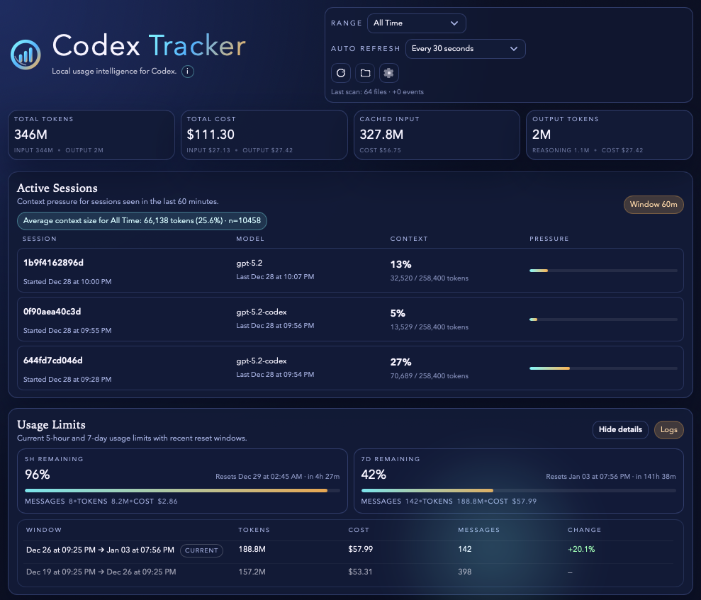
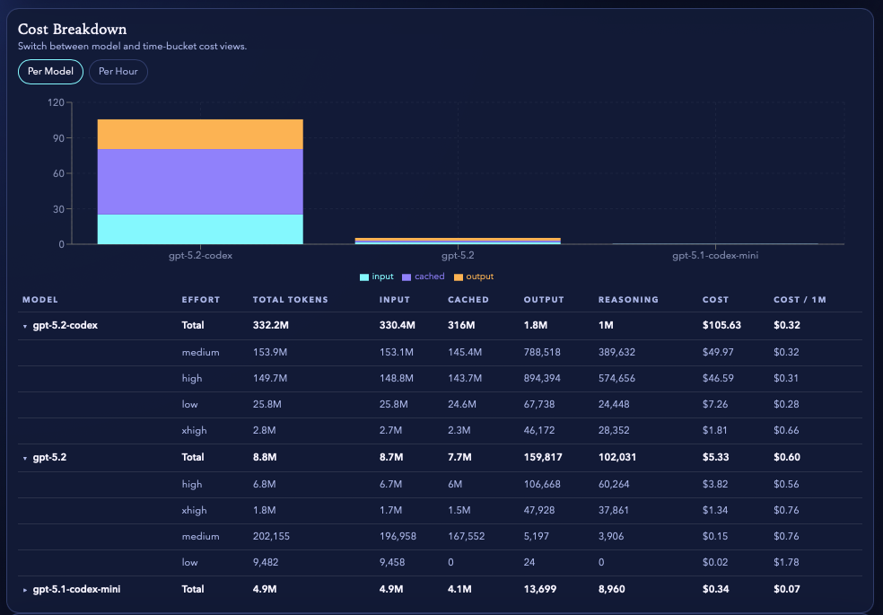
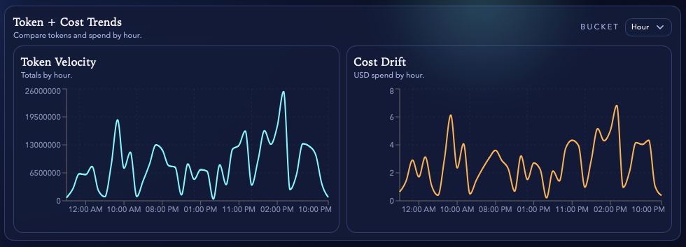

# Codex Tracker

**Codex Tracker** is a **local-only desktop application** for analyzing **Codex CLI usage**
(tokens and cost). It runs entirely on your machine, stores data in a local SQLite database,
and does **not** require any account, cloud service, or remote backend.

The application is built with:

- **Rust** (backend, ingestion, analytics)
- **React + TypeScript** (UI)
- **Tauri** (desktop shell)

---

## Key principles

- **Local-only by design**  
  Everything runs on your device. No telemetry, no cloud sync, no external services.

- **Desktop-first**  
  There is no web app deployment. The UI is bundled into the desktop app.

- **Developer-focused**  
  Optimized for long-running sessions, dense information, and predictable behavior.

---

## Features

- Token and cost totals for a selected time range (and all-time)
- Time-series charts for tokens and cost
- Breakdown by model and reasoning effort (when available)
- Active sessions with context window pressure
- Usage limits (5h / 7d) derived from Codex logs
- Multiple Codex homes (switch between different log directories)
- Editable pricing rules with automatic cost recomputation

---

## Screenshots

### Dashboard overview



### Cost breakdown



### Token and cost trends



---

## Architecture overview

### Rust workspace

- `crates/core/`  
  Shared domain types, ranges, bucketing, and pricing math

- `crates/db/`  
  SQLite schema, migrations, and query layer

- `crates/ingest/`  
  Incremental discovery and ingestion of Codex CLI logs

- `crates/app/`  
  Application services: ingestion orchestration, analytics, defaults

### Desktop application

- `apps/web/`  
  React + TypeScript UI (Vite, Tailwind, Recharts)

- `apps/desktop/src-tauri/`  
  Tauri shell and IPC commands bridging UI and Rust backend

The UI is built once and loaded directly by the Tauri shell.
There is **no runtime web server**.

---

## Installation (macOS)

### Option 1: GitHub Releases (recommended)

Download the latest DMG from GitHub Releases:

https://github.com/ernest-gonzales/codex-tracker/releases

Open the DMG and drag **Codex Tracker** to Applications.

### Option 2: Homebrew (cask)

```bash
brew tap ernest-gonzales/homebrew-tap
brew install --cask codex-tracker
```

### Gatekeeper note

Because releases are **not notarized** (yet), macOS Gatekeeper will likely show a warning on first launch.
This is expected for unsigned distribution.

If you see “**Codex Tracker.app is damaged and can’t be opened**”:

1. Drag the app into `/Applications` (don’t run it from the mounted DMG).
2. Remove the quarantine attribute:

```bash
xattr -dr com.apple.quarantine "/Applications/Codex Tracker.app"
```

If you install via Homebrew, you can also use `brew install --cask --no-quarantine codex-tracker`.
